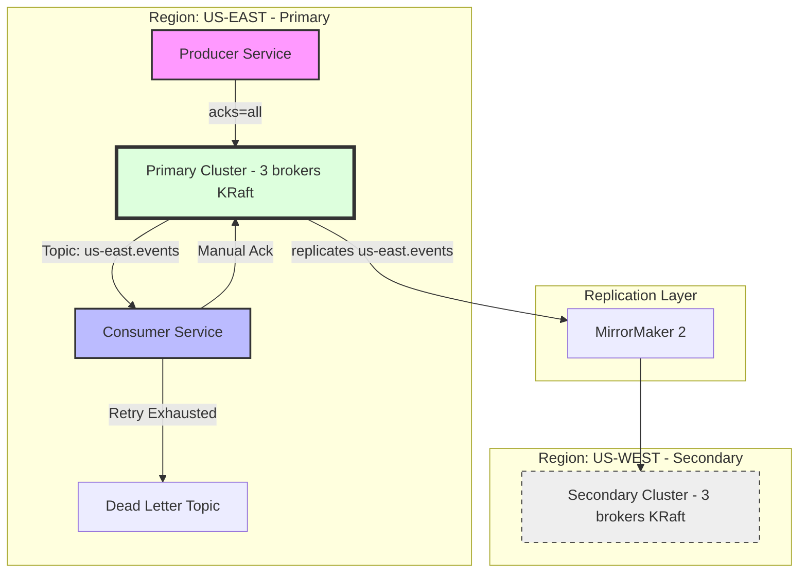

# StreamFlow

> Cross-region Kafka streaming reference implementation in Java 17 + Spring Boot. Two-cluster topology, idempotent producer, manual-ack consumer with DLQ routing.

A working reference for the operational realities of multi-cluster Kafka:
why idempotent producers matter, how partition keys shape ordering
guarantees, where exactly-once breaks down, and how to recover when a
cluster fails.

---

## Status

This project is built in phases. Phases 1 and 2 are complete: two-cluster
topology, idempotent producer, manual-ack consumer with DLQ routing, and
MirrorMaker 2 cross-cluster replication with failover demonstration.
Phase 3 (Prometheus + Grafana observability and Testcontainers integration
tests) is tracked in [`docs/ROADMAP.md`](docs/ROADMAP.md).

See [`docs/ARCHITECTURE.md`](docs/ARCHITECTURE.md) for design decisions
and [`docs/FAILOVER_RUNBOOK.md`](docs/FAILOVER_RUNBOOK.md) for the operational runbook.

---

## Architecture

The system implements a **passive-active multi-region topology** designed for regional fault tolerance and strict data consistency.




## Design decisions

### Why `acks=all` and `enable.idempotence=true`

`acks=all` means the leader waits for all in-sync replicas to acknowledge
before confirming the write. Slower than `acks=1`, but no data loss if
the leader fails before replication. `enable.idempotence=true` deduplicates
producer retries via per-partition sequence numbers, so a network blip
during retry will not produce duplicate messages within a session.

Trade-off: idempotence requires `acks=all` and constrains
`max.in.flight.requests.per.connection` to at most 5. Throughput drops
slightly versus fire-and-forget, but the correctness gain is worth it for
any system that cares about not double-counting events.

### Why partition by tenant ID

All events for the same tenant land on the same partition, guaranteeing
in-order processing per tenant. Cross-tenant ordering is not preserved.
The risk is hot partitions if one tenant's traffic dominates. Per-partition
metrics expose the skew.

### Why manual offset commit

Auto-commit can advance the offset before a consumer has finished
processing. If the consumer crashes between auto-commit and processing,
the message is silently lost. Manual commit means at-least-once delivery,
combined with idempotent downstream operations giving effectively
exactly-once semantics.

### DLQ via DefaultErrorHandler

Retry with exponential backoff (1s, 2s, 4s), then route to dead-letter
topic if the retry budget is exhausted. Without DLQ routing, a poison
message can stall a partition indefinitely.

## Running it locally

### Prerequisites

- Docker Desktop with 8 GB RAM allocated
- Java 17 (`java -version`)
- Maven 3.8+

### Bring up the clusters

```bash
cd docker
docker compose up -d
```

Wait ~60 seconds for both clusters to elect controllers, then:

```bash
docker compose ps
```

All 6 brokers should show `running`.

### Create source topics

```bash
./scripts/create-topics.sh
```

### Run the producer

```bash
cd producer
mvn spring-boot:run
```

Send a test event:

```bash
curl -X POST http://localhost:8080/events \
  -H "Content-Type: application/json" \
  -d '{"tenantId":"tenant-001","type":"ORDER_CREATED","payload":{"orderId":"ord-1","amount":99.99}}'
```

### Run the consumer

In a separate terminal:

```bash
cd consumer
mvn spring-boot:run
```

You should see the consumer log the event within seconds of publishing.

## Repo layout

streamflow/
├── docker/
│   └── docker-compose.yml
├── producer/                   Spring Boot producer service
├── consumer/                   Spring Boot consumer with manual ack and DLQ
├── scripts/
│   └── create-topics.sh
└── docs/                        Architecture and roadmap (in progress)


## What's next

See [`docs/ROADMAP.md`](docs/ROADMAP.md) for the planned phases:
MirrorMaker 2 cross-cluster replication, failover simulation,
Prometheus + Grafana observability, Testcontainers integration tests.

## References

- [Apache Kafka MirrorMaker 2 documentation](https://kafka.apache.org/41/operations/geo-replication-cross-cluster-data-mirroring/)
- Kafka: The Definitive Guide, Chapter 8 (Cross-Cluster Data Mirroring)
- [KIP-382: MirrorMaker 2.0](https://cwiki.apache.org/confluence/display/KAFKA/KIP-382%3A+MirrorMaker+2.0)# streamflow
