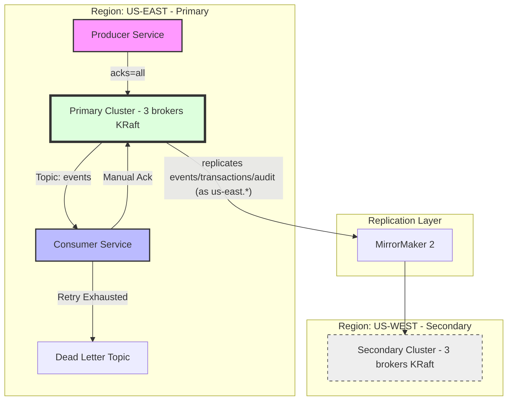
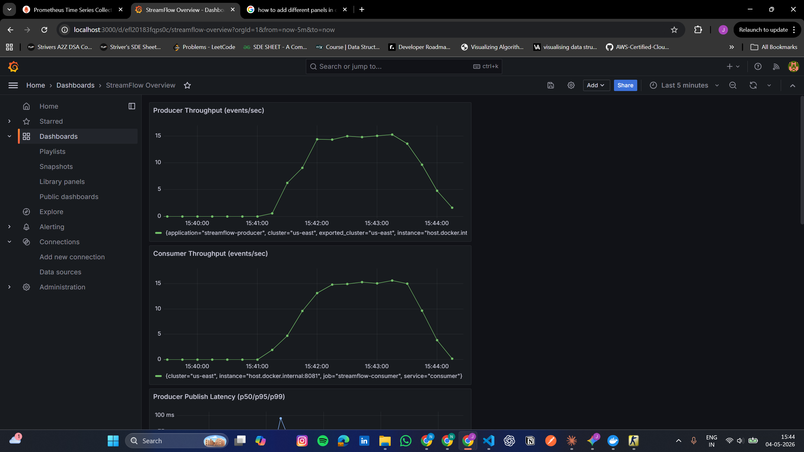

# StreamFlow
[](https://github.com/Nakka-Johnson/streamflow/actions/workflows/build.yml)

> Cross-region Kafka streaming reference implementation in Java 17 + Spring Boot. Two-cluster topology, idempotent producer, manual-ack consumer with DLQ routing.

A working reference for the operational realities of multi-cluster Kafka:
why idempotent producers matter, how partition keys shape ordering
guarantees, where exactly-once breaks down, and how to recover when a
cluster fails.

---

## Status

All three planned phases are complete: two-cluster topology with idempotent
producer and manual-ack consumer (Phase 1), MirrorMaker 2 cross-cluster
replication with failover demonstration (Phase 2), and Prometheus + Grafana
observability with embedded Kafka integration tests (Phase 3).

See [`docs/ARCHITECTURE.md`](docs/ARCHITECTURE.md) for design decisions and
[`docs/FAILOVER_RUNBOOK.md`](docs/FAILOVER_RUNBOOK.md) for the operational runbook.

---

## Architecture

The system implements a **passive-active multi-region topology** designed for regional fault tolerance and strict data consistency.




## Design decisions

### Why `acks=all` and `enable.idempotence=true`

`acks=all` means the leader waits for all in-sync replicas to acknowledge
before confirming the write. Slower than `acks=1`, but no data loss if
the leader fails before replication. `enable.idempotence=true` deduplicates
producer retries via per-partition sequence numbers, so a network blip
during retry will not produce duplicate messages within a session.

Trade-off: idempotence requires `acks=all` and constrains
`max.in.flight.requests.per.connection` to at most 5. Throughput drops
slightly versus fire-and-forget, but the correctness gain is worth it for
any system that cares about not double-counting events.

### Why partition by tenant ID

All events for the same tenant land on the same partition, guaranteeing
in-order processing per tenant. Cross-tenant ordering is not preserved.
The risk is hot partitions if one tenant's traffic dominates. Per-partition
metrics expose the skew.

### Why manual offset commit

Auto-commit can advance the offset before a consumer has finished
processing. If the consumer crashes between auto-commit and processing,
the message is silently lost. Manual commit means at-least-once delivery,
combined with idempotent downstream operations giving effectively
exactly-once semantics.

### DLQ via DefaultErrorHandler

Retry with exponential backoff (1s, 2s, 4s), then route to dead-letter
topic if the retry budget is exhausted. Without DLQ routing, a poison
message can stall a partition indefinitely.

## Running it locally

### Prerequisites

- Docker Desktop with 8 GB RAM allocated
- Java 17 (`java -version`)
- Maven 3.8+

### Bring up the clusters

```bash
cd docker
docker compose up -d
```

Wait ~60 seconds for both clusters to elect controllers, then:

```bash
docker compose ps
```

All 6 brokers should show `running`.

### Create source topics

```bash
./scripts/create-topics.sh
```

### Run the producer

```bash
cd producer
mvn spring-boot:run
```

Send a test event:

```bash
curl -X POST http://localhost:8080/events \
  -H "Content-Type: application/json" \
  -d '{"tenantId":"tenant-001","type":"ORDER_CREATED","payload":{"orderId":"ord-1","amount":99.99}}'
```

### Run the consumer

In a separate terminal:

```bash
cd consumer
mvn spring-boot:run
```

You should see the consumer log the event within seconds of publishing.

## Cross-cluster replication via MirrorMaker 2

MM2 runs in standalone mode inside the secondary cluster, replicating
`events`, `transactions`, and `audit` topics from primary to secondary.
The secondary cluster sees them as `us-east.events`, etc., with the source
cluster alias prefixed.

Three connectors are configured:

- **MirrorSourceConnector**: replicates topic data
- **MirrorCheckpointConnector**: translates consumer offsets across clusters
- **MirrorHeartbeatConnector**: emits liveness signals on both clusters

Start MM2 after the clusters are up and topics exist:

```bash
./scripts/start-mm2.sh
```

Verify replication by sending an event to the producer (which writes to
primary) and consuming from `us-east.events` on the secondary:

```bash
docker exec secondary-broker-1 /opt/kafka/bin/kafka-console-consumer.sh \
  --bootstrap-server secondary-broker-1:19092 \
  --topic us-east.events --from-beginning --max-messages 5 --timeout-ms 10000
```

### Failover demonstration

```bash
./scripts/simulate-failover.sh
```

This script stops the primary cluster, verifies the secondary is still
healthy, and consumes the replicated data from secondary to prove DR
readiness. See [`docs/FAILOVER_RUNBOOK.md`](docs/FAILOVER_RUNBOOK.md)
for the full operational procedure.

## Observability

Both producer and consumer expose Prometheus metrics at `/actuator/prometheus`.
A Grafana dashboard visualises throughput, latency percentiles (p50/p95/p99),
and failure counters across both services.



### Bring up Prometheus and Grafana

```bash
docker compose -f docker/docker-compose.yml up -d prometheus grafana
```

- Prometheus: http://localhost:9090
- Grafana: http://localhost:3000 (admin/admin)

The Prometheus targets page (Status -> Targets) should show both services as
UP once the producer and consumer apps are running.

### Generate load for the dashboard

```bash
./scripts/load-test.sh 1000 50    # 1000 events at 50/sec
```

## Testing

Both modules ship with integration tests that use an embedded Kafka broker
(via `spring-kafka-test`), so `mvn test` runs without Docker:

```bash
cd producer && mvn test
cd consumer && mvn test
```

Tests cover:

- Producer: single-event publish, partition-key consistency for the same
  tenant, end-to-end round trip
- Consumer: end-to-end processing of published events through the
  Spring Kafka listener with manual offset commit

The GitHub Actions workflow at `.github/workflows/build.yml` runs both
test suites on every push to main.

## Repo layout

streamflow/
├── docker/
│   └── docker-compose.yml
├── producer/                   Spring Boot producer service
├── consumer/                   Spring Boot consumer with manual ack and DLQ
├── scripts/
│   └── create-topics.sh
└── docs/                        Architecture and roadmap (in progress)


## What's next

See [`docs/ROADMAP.md`](docs/ROADMAP.md) for future work ideas and extensions.

## What I learned building this

A few things that surprised me, in case they're useful to anyone reading this code:

1. **Consumer lag is not a single number.** It is per partition. A healthy
  aggregate lag can hide a single stuck partition. Per-partition tracking
  is the only way to catch this early.

2. **MM2 replication lag is mostly polling, not network.** The default
  `refresh.topics.interval.seconds` is 600. For development, dropping it
  to 30 makes the system feel responsive. For production the trade-off is
  metadata churn vs faster topic detection.

3. **`max.poll.records` matters more than you would expect.** If a single
  poll returns 500 records and processing each takes 50ms, the consumer
  spends 25 seconds before the next heartbeat. With the default 30s
  session timeout, you are one slow batch away from being kicked out
  of the group. Either lower `max.poll.records` or raise
  `max.poll.interval.ms`.

4. **Offset translation is best-effort.** MM2's checkpoint connector
  writes translations periodically. If the primary fails between
  checkpoints, the secondary's last known offset for a consumer group
  may be slightly behind. The system has to be designed to handle small
  windows of reprocessing.

5. **Embedded Kafka tests are a pragmatic default.** `spring-kafka-test` keeps
  the test workflow Docker-free while still exercising real broker behaviour.

## References

- [Apache Kafka MirrorMaker 2 documentation](https://kafka.apache.org/41/operations/geo-replication-cross-cluster-data-mirroring/)
- Kafka: The Definitive Guide, Chapter 8 (Cross-Cluster Data Mirroring)
- [KIP-382: MirrorMaker 2.0](https://cwiki.apache.org/confluence/display/KAFKA/KIP-382%3A+MirrorMaker+2.0)
